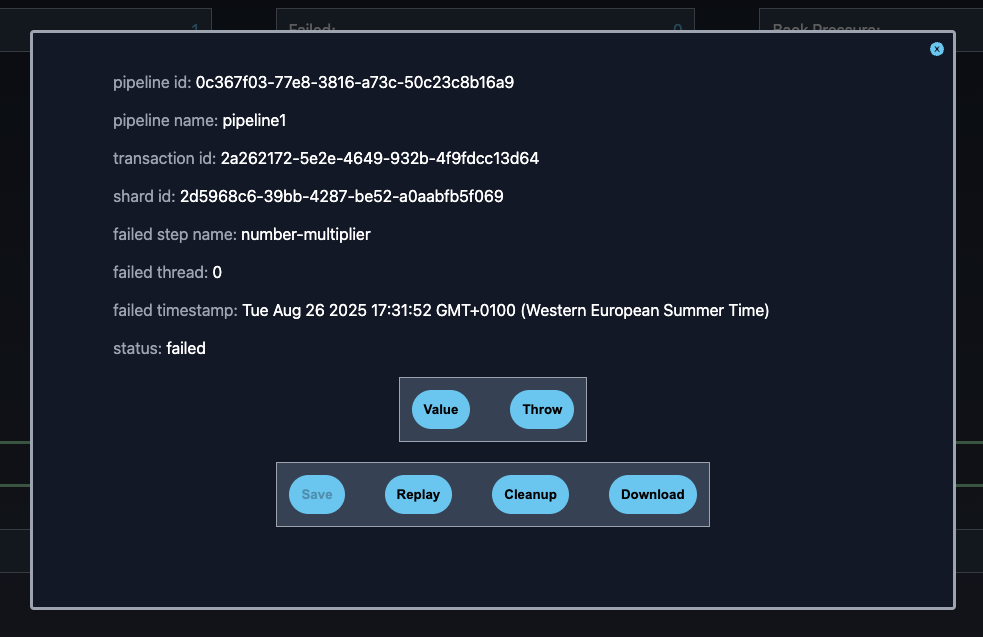

# St0rmWatch3r

St0rmWatch3r is a companion App for the Sn0wst0rm framework that is used mainly for monitoring purposes and for error
handling.

It can be used to monitor the performance of the application as well as the JVM statistics regarding memory and cpu usage.

## Setting up a connection

To setup a connection, open the main landing page for St0rmWatch3r, and you will find a screen like this:

On the instance details, just add a connection name (can't have any spaces), and the application URL.
The URL needs to contain the port (if needed). If you are using an https connection, set the secure connection
checkmark.

URL example `localhost:8183`

After you click add, the connection will be added to your browser like so:

On the grid you can easily identify the connection you just created by its name, the address used, whether it is secure or not,
and the version of sn0wst0rm the instance is running. On the far right, you can see 2 buttons, a refresh button and a remove button.

The refresh button is used to refresh the version, think of it as a manual health check, that you can use to check if the 
instance is still up. The remove button is to remove the connection from your collection.

## Using a connection

After the connection is setup, you can now actually use the application to monitor your Sn0wst0rm instance.
You can go to the top navbar, and select connections. This will show you a drop down menu, where you will find 
the name of the connection you just setup.

When you hover over the name, you will see 2 extra selections, JVM Metrics and pipelines. Let's start with JVM metrics.

### JVM Metrics

JVM metrics, as the name might indicate is the place where you can check all your JVM related stuff, be it heap sizes, 
thread count, etc.

On the left you notice that there's a small button hovering over the screen. If you press it, you can get extra details
on the machine running the application, like disk space, and also other options.

There are multiple buttons on this menu, like:
- `GC Collect` - used to collect the Garbage generated by the JVM application (usually not a good practice to do so);
- `Heap Dump` - used to dump the heap to a file;
- `Heap Download` - used to download the newest heap dump;
- `Rules` - This opens up a modal where you can configure rules to send you notifications when the cpu usage and other metrics
go over a certain threshold.

### Pipelines

Pipelines are the heart of the application, this is where the 'magic happens'.

In pipelines each rectangle you see is an actual data pipeline configured in this particular Sn0wst0rm instance.
If the border of the rectangle is `green` it means the pipeline is running, if the color is `red`, 
it means the pipeline is not running at the moment.

Each pipeline has a few numbers on the top:

- `Started` - the number of transactions started by the pipeline;
- `Terminated` - the number of transactions terminated by the pipeline;
- `Failed` - the number of transactions failed;
- `Back pressure` -  the number of transactions in processing state;
- `Stopped at` - the time the pipeline was stopped at, it will be blank most of the time.

### Generic Step
If we click on one of the steps inside the rectangle, for instance the one that says `number-generator2`, 
we get something like:

This screen is the detail look of the step, in here you can check the graph to see some statistics about it, 
like how long it takes on `average` to run its function, `median` and `standard deviation` values.

At the bottom we have a bunch of buttons:

- `Test` - this is used to test values for processing, this means we can test a step by giving it an input directly 
from the browser and getting the result from it in the browser as well. This allows for debugging, although it needs to be
enabled in the configuration itself, otherwise it will be greyed out.
- `Stop` - to stop the step from running.

The `Threads` button if clicked will show you something like this:

You can change the number and press set, this will set the number of threads to the number you chose.
ATTENTION: in order for this to work, the pipeline needs to be stopped first, not only the step.
It is fine though, if it is running, as the text area/set button will be deactivated.

The `poll frequency` button is also important, as it let's you set the interval at which the function for that particular
step will be run at. If clicked it will look like this:

The poll frequency is set with a value, and a unit. The units are selected from a drop down menu on the right 
of the number area and the selectable values are:

- `nanoseconds`;
- `microseconds`;
- `milliseconds`;
- `seconds`;
- `minutes`;

The last button is the `gear` button, this button allows you to see the configuration of that particular step.

### Channels

If instead of clicking in a step, we click on the edge linking it, we get something like

In here we can get details on how long on `average` it takes to put/take to the channel that interconnects the steps.

We also get some information on how many values were passed to, read from the channel.

Finally we can actually set the buffer size, by default the buffersize is set to 100, but we can modify the channel through the ui.

### Jobs

Jobs are the ones that have a light blue background color. These differ from all other steps, as they are configured in a different way.

Let's click on one and see what happens.

As you can see, we have the same information in the graph, but then we have when it was last triggered, when was the last
running attempt, if it was triggered and finally what is the current status.

We also have some buttons at the bottom.

- `Start/Stop` - start/stop the job;
- `Trigger` - manually trigger the job without having to wait for it to trigger as scheduled;

The `Schedule` button, allows you, if the pipeline is stopped, to change the job schedule on the fly. The schedule uses
a similar configuration as a regular cronjob on any unix system.

Finally the `gear` button serves the same function as the other steps, to read the step configuration.

### Failed Transactions

If you have read everything up until now, you have noticed that I have mentioned failed transactions. 
These are transactions that have caused an error in the system (or exception) and have been captured by the system in a way
that makes it easy for you to analyse.

To get to failed transactions, just get to a pipeline, and on the bottom of it, press failed (the red button).

You will be presented with a possible list of UUIDs, these UUIDs represent transaction ids. Each transaction, can be divided
into shards, so when you press on a transaction, you can be presented with a list of UUIDs, each of those being a shard id.

Before we press the shard id, we can analyse the buttons on the bottom. Once a transaction is selected, you will be able to
use the `Cleanup` and `Cleanup All` buttons. These buttons are used to basically get rid of the failed transactions, 
because you might not care at all about those, and you just want to get rid of them to free up memory (later we will introduce
a freezing mechanism to flush to disk old transactions so that memory is never a problem).

The `Download All` button is used to download a binary file containing all failed transactions. This can be used to download
the transaction file from a production environment, and then using that file locally to debug the transactions, making it easy
to debug the production environment without the need to have a JMX connection to it.

Going back to the shard, if we press the shard id, we will get a screen like so:

This screen, contains relevant data to the failed transaction.

- `pipeline id` - the id of the pipeline;
- `pipeline name` - the pipeline name used in the config;
- `transaction id` - the id of the failed transaction;
- `shard id` - the id of the failed shard;
- `failed step name` - the name of the step where the exception occurred;
- `failed thread` - the thread number where the exception was raised;
- `failed timestamp` - the moment the failure occurred;
- `status` - the current status, which will be failed.

Besides this information, you will have a bunch of buttons.

- `Download` - allows you to download this specific transaction to be used in another system, so no need to download all of them.
- `Cleanup` - allows you to get rid of this transaction if you don't care about that specific error.

The `value` button, if clicked, will show you exactly what value the step was processing at that time when it failed.

The `throw` button will allow you to see the stack trace as well as any metadata attached to the exception i.e. if you throw
and `ex-info`, the data you need to add to it, will be displayed here.

The `replay` button allows you to actually replay the transaction from any step you wish (besides sources).

This will enable you to basically find an issue, stop the system, fix the issue, deploy a new version, and then rerun the 
transaction from the exact point it failed.

Another case is if the problem was found on a previous step, which means that the transaction failed, because a previous step
was responsible for the miscalculation that lead to the exception down the road. You can then select the previous step
you want from the dropdown, and replay the actual value that step received the first time (yes we keep track of historic values
for transactions while processing them).

# Conclusion

This tutorial is meant to help with using `St0rmWatch3r`. This will be constantly evolving, so I expect it to have some
issues here and there, or even missing examples. If you find that something is not correctly explained, or there's something
missing, please let me know.

[Welcome](.)